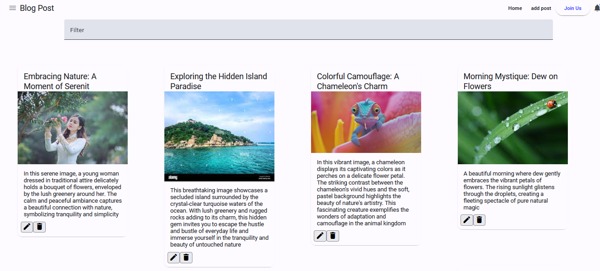
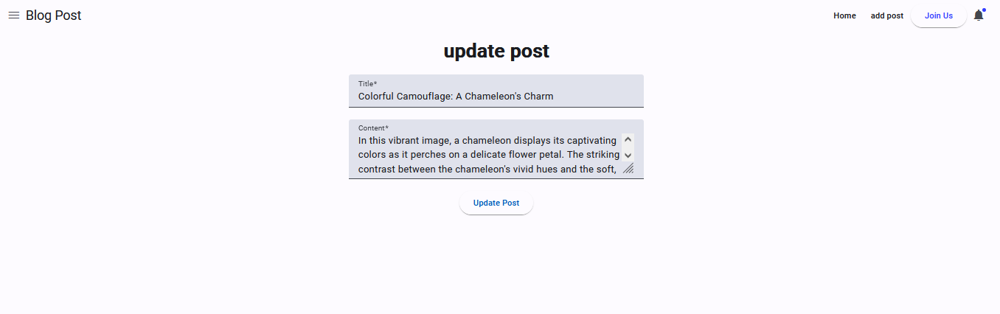

# Posts App

A simple Angular application for managing posts, using NgRx for state management. The application allows users to add, edit, and delete posts.

## Table of Contents

- [Features](#features)
- [Getting Started](#getting-started)
- [Screenshots](#screenshots)
- [Technologies](#technologies)
- [Contributing](#contributing)
- [License](#license)

## Features

- Add new posts
- Edit existing posts
- Delete posts
- State management with NgRx
- Notifications for user actions

## Getting Started

### Prerequisites

- Node.js (>= 12.x)
- Angular CLI (>= 10.x)

### Installation

1. Clone the repository:
   ```bash
   git clone https://github.com/your-username/posts-app.git


Navigate to the project directory: cd posts-app
Install the dependencies: npm install
run json-server : json-server --watch src/app/db.json --port:3000
Start the development server:ng serve


Screenshots
Home Page



Add Post


Edit Post



Filter


Technologies
Angular
NgRx
JSON Server
TypeScript
MatérilaUI


